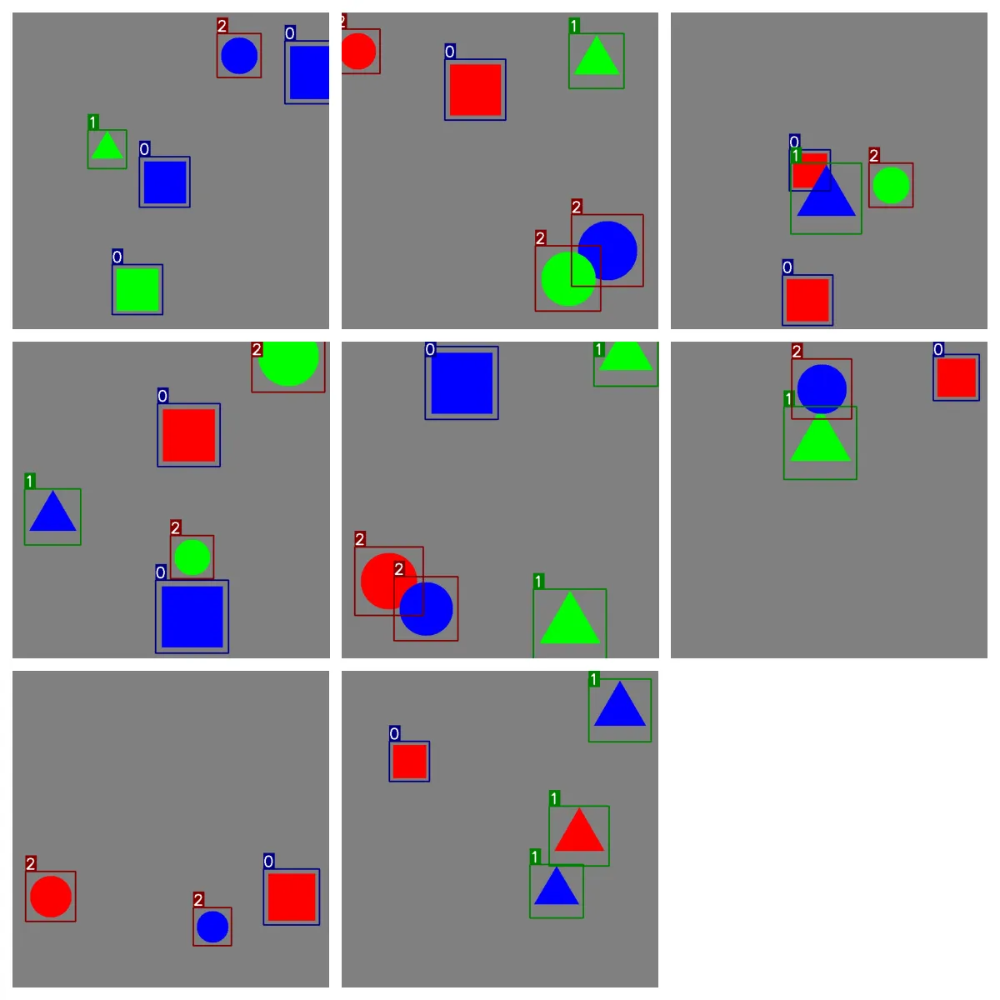

<div align="center">

# Lightning ⚡ YOLOs

**Educational & Experimental YOLO Training Framework with Lightning**

[](https://github.com/Borda/lightning-YOLOs)
[](https://github.com/Borda/lightning-YOLOs/actions)
[](https://results.pre-commit.ci/latest/github/Borda/lightning-YOLOs/main)

[Features](#-features) • [Installation](#-installation) • [Quick Start](#-quick-start) • [Documentation](#-documentation) • [Contributing](#-contributing)

</div>

______________________________________________________________________

## 🎯 Overview

Lightning-YOLOs is an educational framework for learning how to train YOLO models using Lightning. This project demonstrates best practices in ML engineering, modular architecture design, and modern Python development workflows.

> 🎓 **Learning Goals**: Ideal for students and developers who want to understand how to integrate YOLO models with Lightning, implement both standard and oriented bounding box detection, and build production-ready ML codebases.

### 🔥 Why This Project Exists

- **📚 Educational Focus**: Learn Lightning patterns with real-world YOLO models
- **🧪 Experimentation**: Safe environment to test ideas and learn ML workflows
- **🎨 Multiple Detection Modes**: Explore both standard bounding boxes and Oriented Bounding Boxes (OBB)
- **📊 Modern Practices**: See how to integrate metrics, logging, and testing in ML projects
- **⚙️ Clean Architecture**: Study modular design with CLI, data modules, and training orchestration
- **🛠️ Development Workflow**: Experience pre-commit hooks, CI/CD, and code quality tools

______________________________________________________________________

## ✨ Features

| Feature                   | Description                                                                           | Status |
| ------------------------- | ------------------------------------------------------------------------------------- | ------ |
| **🎯 Standard Detection** | Classic axis-aligned bounding boxes for general object detection                      | ✅     |
| **🔄 OBB Detection**      | Rotated bounding boxes for aerial/satellite imagery and oriented objects              | ✅     |
| 📊 Advanced Metrics       | TorchMetrics mAP calculation for both training and validation                         | 🔄     |
| **⚡ Mixed Precision**    | Various Precisions and Training strategies with Lightning for faster training | ✅     |
| **🔧 Auto Configuration** | Automatic class detection from dataset                                                | ✅     |
| **🏗️ Modular Design**     | Clean, extensible architecture with Lightning                                 | ✅     |
| **🧪 Synthetic Data**     | Built-in synthetic dataset generator for testing                                      | ✅     |
| **👁️ Visualization**      | Dataset visualization tools with bounding box annotations                             | ✅     |

______________________________________________________________________

## 📦 Installation

```bash
# Create a virtual environment (recommended)
python -m venv venv
source venv/bin/activate  # On Windows: venv\Scripts\activate

# Quick install
pip install .

# Development install with all tools
pip install -e ".[dev]"

# Verify installation
lit-yolo --help
```

______________________________________________________________________

## 🚀 Quick Start

> 💡 **Tip**: Start with synthetic data to understand the workflow before using real datasets.

### 🎯 Standard Object Detection

Train a YOLO model for standard object detection in just one command:

```bash
# Start training with default settings
lit-yolo train detect --data /path/to/dataset --model yolo11n.pt
```

<details>
  <summary>Advance configuration (click to expand)</summary>

```bash
# Customize your training (experiment with parameters!)
lit-yolo train detect \
    --data /path/to/dataset \
    --model yolo11n.pt \
    --epochs 100 \
    --batch_size 16 \
    --lr 0.001
```

</details>

### 🔄 Oriented Bounding Box Detection

For aerial imagery or rotated objects:

```bash
# Train OBB model
lit-yolo train obb --data /path/to/data --model yolo11n-obb.pt
```

### 🧪 Test with Synthetic Data

Perfect for learning and validating your setup:

```bash
# Generate synthetic dataset (great for learning!)
lit-yolo create dataset --output ./test_data --num_samples 100

# Train on synthetic data (fast experimentation)
lit-yolo train detect --data ./test_data --model yolo11n.pt --epochs 10
```

### 👁️ Visualize Your Dataset

Preview your data before training:

```bash
# Visualize and save to file
lit-yolo show dataset --data /path/to/dataset --output preview.jpg

# Interactive visualization
lit-yolo show dataset --data /path/to/dataset
```

______________________________________________________________________

## 💻 Python API

> 🎓 **Note**: These examples show how to use the components programmatically.

### Standard Detection Example

```python
from lit_yolo import LitYOLODet, DetDataModule
from lightning import Trainer

# Or use components directly for more control (learn the architecture!)
dm = DetDataModule(data="/path/to/dataset", batch_size=8)
model = LitYOLODet(model_name="yolo11n.pt", num_classes=80)

trainer = Trainer(max_epochs=100, accelerator="gpu", devices=1)
trainer.fit(model, datamodule=dm)
```

### OBB Detection Example

```python
from lit_yolo import LitYOLOOBB, OBBDataModule
from lightning import Trainer

# Granular control (understand how components interact)
dm = OBBDataModule(data="/path/to/data", batch_size=8)
model = LitYOLOOBB(model_name="yolo11n-obb.pt", num_classes=15)

trainer = Trainer(max_epochs=100, precision="16-mixed")
trainer.fit(model, datamodule=dm)
```

______________________________________________________________________

## 🗂️ Project Structure

> 📚 **Explore**: Check these modules to understand the architecture.

```
src/lit_yolo/
├── __init__.py          # 📦 Package exports
├── __main__.py          # 🚪 CLI entry point
├── data/                # 📊 Data handling
│   ├── datasets.py      #   - Dataset classes
│   ├── data_modules.py  #   - Lightning DataModules
│   ├── utils.py         #   - Data utilities
│   └── visual.py        #   - Visualization tools
├── models.py            # 🧠 Lightning modules
│                        #   - BaseLitYOLO
│                        #   - LitYOLODet
│                        #   - LitYOLOOBB
└── training.py          # 🏋️ Training orchestration
```

______________________________________________________________________

## 📋 Dataset Formats

### Standard Detection Format

```text
# Format: class_id x_center y_center width height
# All values normalized to [0, 1]

0 0.5 0.5 0.3 0.4
1 0.2 0.3 0.15 0.2
```

### Oriented Bounding Box (OBB) Format

```text
# Format: class_id x1 y1 x2 y2 x3 y3 x4 y4
# Four corner points, normalized to [0, 1]

0 0.1 0.1 0.9 0.1 0.9 0.9 0.1 0.9
```

> **💡 Tip**: The OBB loader automatically handles both formats! Standard format boxes are converted with rotation=0.

______________________________________________________________________

## 🧪 Synthetic Dataset Generator

Perfect for testing, debugging, and learning without requiring real data:

```bash
# Generate with default settings (shape-based classes)
lit-yolo create dataset --output ./synthetic_data
```

**What you get:**

- ✅ Three geometric shapes (square, triangle, circle)
- ✅ Three colors (red, green, blue)
- ✅ Valid YOLO format labels
- ✅ Train/val splits
- ✅ Perfect for learning and CI/CD testing

<details>
  <summary>Customize Synthetic Data (click to expand)</summary>

```bash
# Customize your synthetic data (experiment with parameters!)
lit-yolo create dataset \
    --output ./custom_synthetic \
    --num_samples 200 \
    --split_ratio 0.8 \
    --img_size 640 \
    --class_mode color \
    --min_objects 2 \
    --max_objects 5 \
    --seed 42

# View all options
lit-yolo create dataset --help
```

</details>



______________________________________________________________________

## 📚 Documentation

### Example Datasets

#### DATA v1.5 (OBB Dataset)

```bash
# Download and extract DATA dataset
wget https://www.ultralytics.com/assets/DOTAv1.5.zip
unzip -qq DOTAv1.5.zip
python -m py_tree DOTAv1.5 -d 1
```

### Additional Resources

- 📖 [Lightning Docs](https://lightning.ai/docs/pytorch/stable/)
- 📖 [Ultralytics YOLO Docs](https://docs.ultralytics.com/)
- 📝 [Contributing Guide](.github/CONTRIBUTING.md)
- 📝 [Code of Conduct](.github/CODE_OF_CONDUCT.md)

______________________________________________________________________

## 🤝 Contributing

> 🎓 **Welcome**: Contributing is a great way to learn! We welcome educational contributions.

We welcome contributions, especially those that improve the educational value of this project!

1. **Fork** the repository
2. **Clone** your fork: `git clone https://github.com/YOUR_USERNAME/lightning-YOLOs.git`
3. **Install** dev dependencies: `pip install -e ".[dev]"`
4. **Create** a branch: `git checkout -b feature/amazing-feature`
5. **Make** your changes and add tests
6. **Run** tests: `pytest .`
7. **Format** code: `pre-commit run --all-files`
8. **Submit** a pull request

See [CONTRIBUTING.md](.github/CONTRIBUTING.md) for detailed guidelines.

______________________________________________________________________

## 📄 License

This project is licensed under the **GNU General Public License v3.0** (GPL-3.0). See [LICENSE](LICENSE) for details.

______________________________________________________________________

## ⚠️ Disclaimer

This is an experimental educational project for learning purposes:

- ✅ Great for learning Lightning + YOLO
- ✅ Demonstrates modern ML engineering practices
- ✅ Safe for experimentation and education
- ⚠️ Not battle-tested for production use
- ⚠️ May contain bugs and evolving features

Always validate results thoroughly if adapting for any application.

______________________________________________________________________

## 🌟 Star History

If you find this project helpful for learning, please consider giving it a star! ⭐

______________________________________________________________________

<div align="center">

**Built with ❤️ for learning Lightning & YOLO**

[Report Issues](https://github.com/Borda/lightning-YOLOs/issues) • [Ask Questions](https://github.com/Borda/lightning-YOLOs/discussions) • [Share Learning Experiences](https://github.com/Borda/lightning-YOLOs/discussions)

</div>
